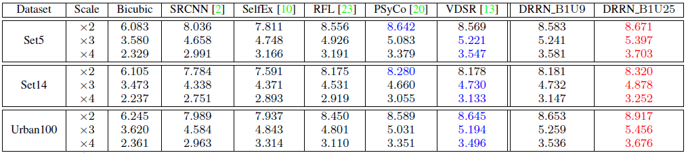
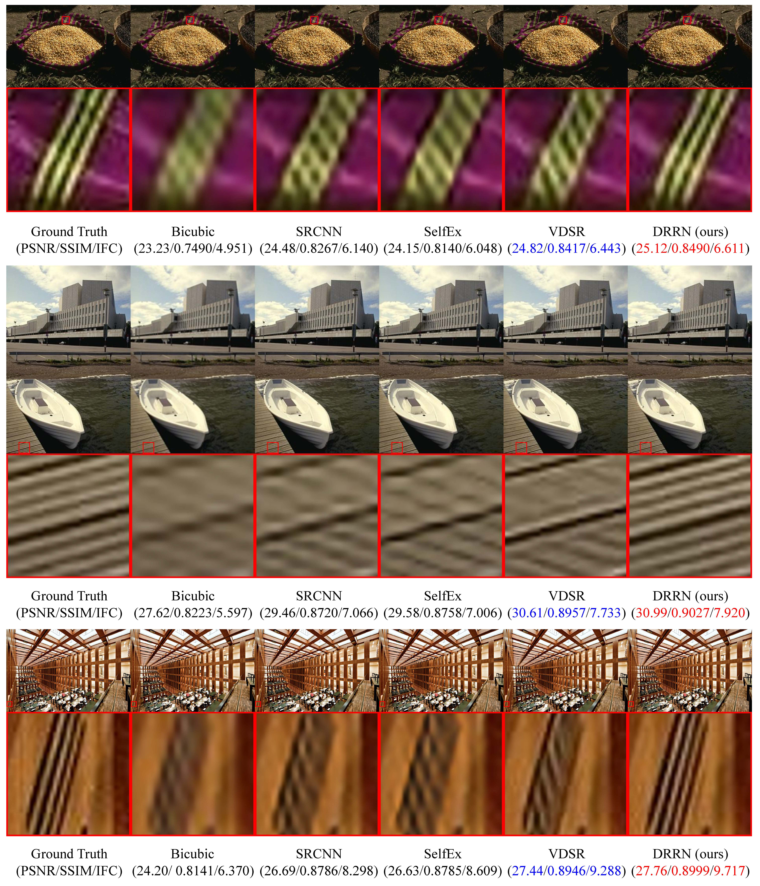
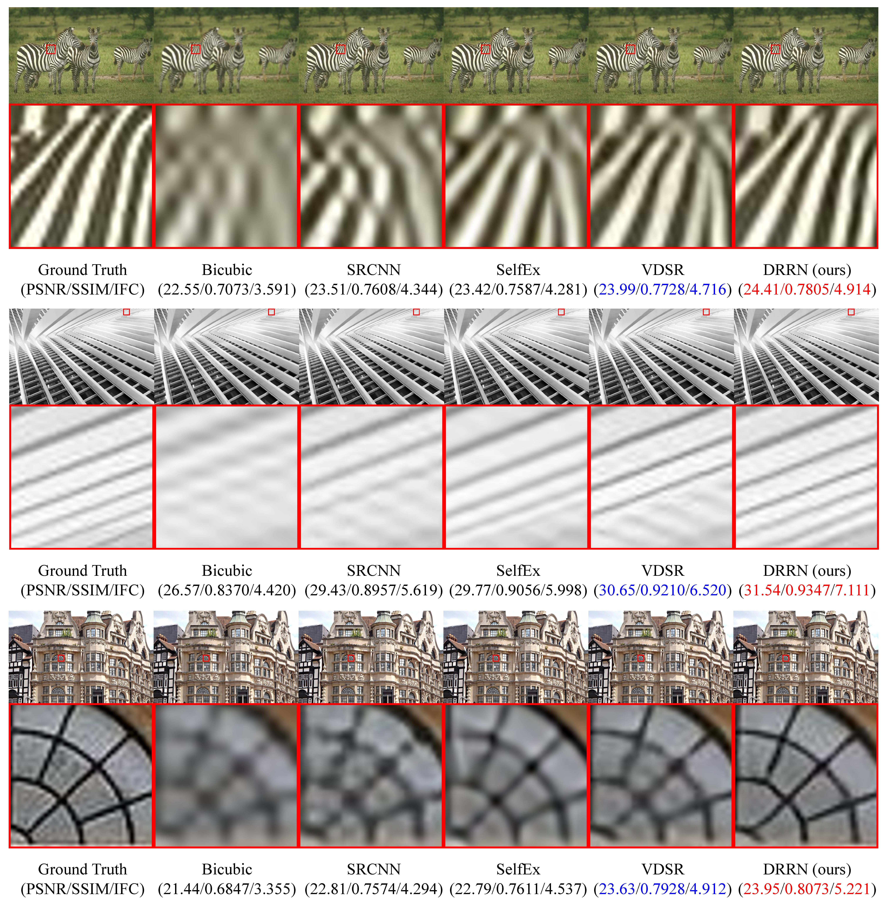
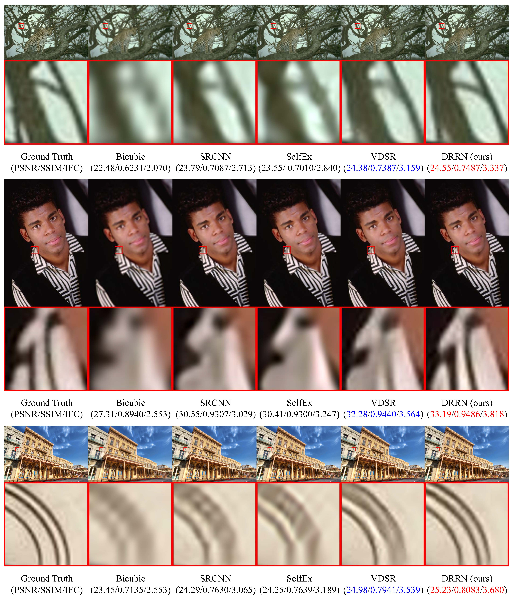

# DRRN
### [[Paper]](http://cvlab.cse.msu.edu/pdfs/Tai_Yang_Liu_CVPR2017.pdf)[[Project]](http://cvlab.cse.msu.edu/project-super-resolution.html)

### Citation
If you find DRRN useful in your research, please consider citing:

	@inproceedings{Tai-DRRN-2017,
	  title={Image Super-Resolution via Deep Recursive Residual Network},
	  author={Tai, Ying and Yang, Jian and Liu, Xiaoming },
	  booktitle={Proceedings of the IEEE Conference on Computer Vision and Pattern Recognition},
	  year={2017}
	}

# Other implementation
[[DRRN-pytorch]](https://github.com/jt827859032/DRRN-pytorch) by yun_yang

# Implement adjustable gradient clipping 
modify sgd_solver.cpp in your_caffe_root/src/caffe/solvers/, where we add the following codes in funciton ClipGradients():

Dtype rate = GetLearningRate();

const Dtype clip_gradients = this->param_.clip_gradients()/rate;

# Training
1. Preparing training/validation data using the files: generate_trainingset_x234/generate_testingset_x234 in "data" folder. "Train_291" folder contains 291 training images and "Set5" folder is a popular benchmark dataset.
2. We release two DRRN architectures: DRRN_B1U9_20C128 and DRRN_B1U25_52C128 in "caffe_files" folder. Choose either one to do training. E.g., run ./train_DRRN_B1U9_20C128.sh

# Test
1. Remember to compile the matlab wrapper: make matcaffe, since we use matlab to do testing.
2. We release two pretrained models: DRRN_B1U9_20C128 and DRRN_B1U25_52C128 in "model" folder. Choose either one to do testing on benchmark Set5. E.g., run file ./test/DRRN_B1U9_20C128/test_DRRN_B1U9, the results are stored in "results" folder, with both reconstructed images and PSNR/SSIM/IFCs.
    
# Benchmark results
## Quantitative results
### PSNR/SSIMs
 

### IFCs
 

## Qualitative results
### Scale factor x2
 

### Scale factor x3
 

### Scale factor x4
 
